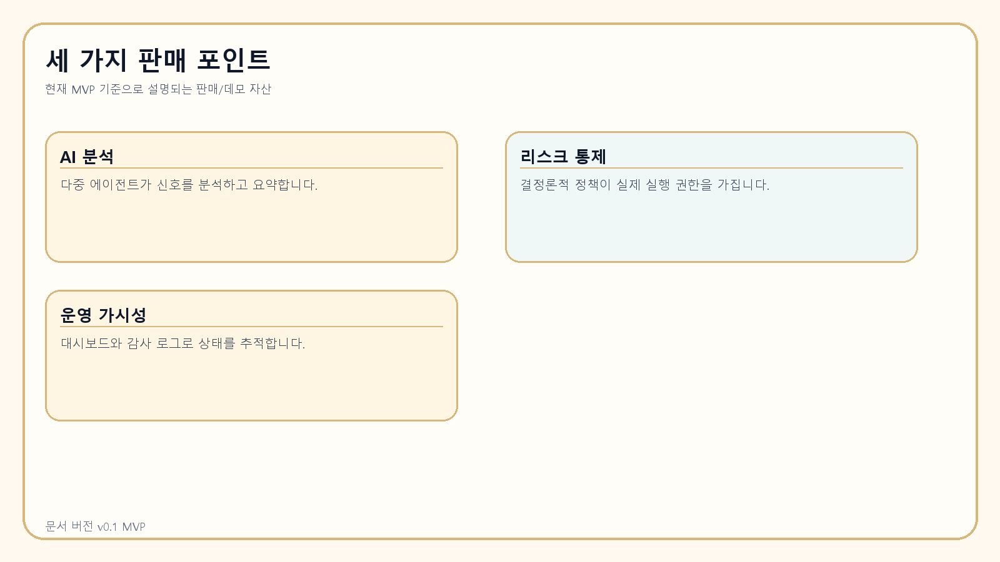
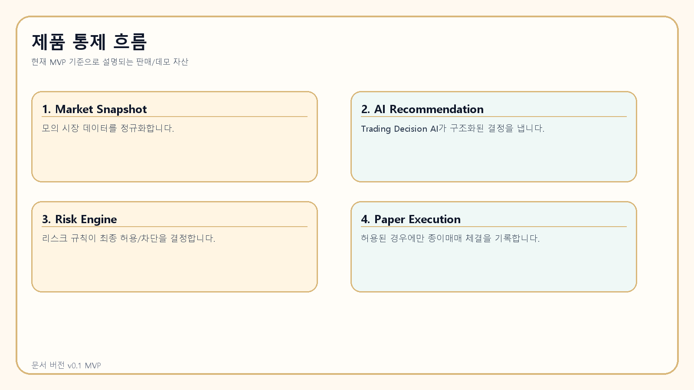
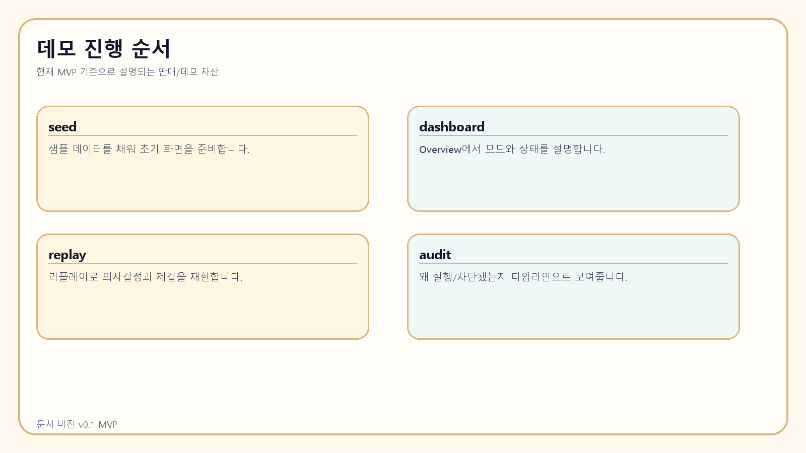

# 고객용 판매 가이드

> 문서 버전: v0.1 MVP
>
> 문서 대상: 기업 고객 / 개인 고객 공통
>
> 설명 기준: 현재 리포지토리에 구현된 종이매매 MVP 범위
>
> 작성일: 2026-04-07

## 제품 한 줄 설명

AI가 분석과 요약을 수행하고, 결정론적 리스크 엔진이 실제 실행 권한을 통제하는 종이매매 우선 자동매매 운영 플랫폼입니다.

## 어떤 문제를 해결하는가

- 시장 신호는 많지만 실제 실행 기준이 불명확한 문제
- 자동매매가 왜 실행되거나 차단됐는지 설명하기 어려운 문제
- 운영 로그와 감사 추적이 분리돼 사후 분석이 어려운 문제
- 전략 아이디어를 실거래 전 종이매매와 리플레이로 검증하기 어려운 문제

## 핵심 기능 설명

### 5개 AI 역할

- Trading Decision AI
  시장 스냅샷과 특징을 바탕으로 `hold / long / short / reduce / exit` 형태의 구조화된 결정을 생성합니다.
- Chief Review AI
  최근 결정, 리스크 결과, 시스템 상태, 알림을 종합해 운영 모드와 우선 대응을 제안합니다.
- Integration Planner AI
  시스템 로그와 리스크/스케줄 정보를 바탕으로 어디를 더 자동화하고 개선해야 하는지 제안합니다.
- UI/UX AI
  대시보드 피드백을 바탕으로 화면 설명력과 운영자 사용성을 개선할 아이디어를 제안합니다.
- Product Improvement AI
  경쟁사 메모, KPI, 기존 백로그를 검토해 다음 제품 개선 항목을 제안합니다.

### 결정론적 리스크 엔진

- 최대 레버리지 3배 제한
- 거래당 최대 리스크 1.00% 제한
- 일일 손실 한도 2.00% 제한
- 연속 손실 3회 이후 신규 진입보다 HOLD 선호
- 손절/익절 누락 시 신규 진입 차단
- stale / incomplete 데이터 차단
- 슬리피지 임계치 초과 시 주문 거부
- 시스템 일시중지 스위치 제공

### 종이매매 실행 엔진

- 승인된 결정만 paper execution으로 기록
- 주문, 체결, 포지션, PnL 스냅샷 저장
- filled / rejected 상태 지원
- 감사 로그와 대시보드에 즉시 반영

### 운영 대시보드

- Overview
- Market / Signals Snapshot
- Decisions
- Positions
- Orders / Executions
- Risk
- Agents
- Scheduler
- Audit
- Settings
- Product Improvement Backlog

### 감사 로그와 운영 추적

- agent output 저장
- risk check 결과 저장
- execution attempt와 state transition 저장
- alert와 system health event 저장
- 운영자가 “왜 HOLD인지”와 “왜 실행됐는지”를 화면에서 추적 가능

### 리플레이와 시뮬레이션

- seeded 데이터로 빠른 데모 가능
- replay 모드로 의사결정과 실행을 재현 가능
- 실거래 전 운영 흐름을 안전하게 검증 가능

## 안전 기능

- paper trading이 기본입니다.
- live trading은 기본 비활성입니다.
- AI는 분석과 추천만 하고, 실행 권한은 리스크 엔진이 가집니다.
- 손절/익절이 없거나 방향이 잘못되면 진입이 차단됩니다.
- stale / incomplete 데이터면 실행이 차단됩니다.
- 슬리피지 임계치 초과 시 주문이 거부됩니다.
- daily loss / consecutive loss 게이트가 작동합니다.
- emergency pause로 신규 진입을 즉시 차단할 수 있습니다.

## 기업 고객에게 설명할 가치

- 운영 통제 구조가 명확합니다.
- 감사 로그와 타임라인으로 추적 가능성이 높습니다.
- AI 추천과 실제 실행이 분리돼 내부 통제 설계에 유리합니다.
- 대시보드가 팀 협업과 운영 검토에 적합합니다.
- 향후 기존 시스템과의 통합 경계를 설계해 두었습니다.

## 개인 고객에게 설명할 가치

- 감정이 아니라 규칙에 기반해 운영할 수 있습니다.
- 종이매매로 먼저 검증하고 이해한 뒤 다음 단계를 판단할 수 있습니다.
- 왜 HOLD인지, 왜 차단됐는지 확인할 수 있습니다.
- 실행/차단 사유를 화면에서 읽을 수 있습니다.
- replay를 통해 전략과 운영을 학습할 수 있습니다.

## 현재 범위와 한계

- 현재 시장 데이터는 synthetic market data 기반입니다.
- 외부 LLM은 deterministic mock provider가 기본입니다.
- live trading은 실사용 어댑터가 연결되어 있지 않습니다.
- 현재 제품은 실거래 자동화 완성품이 아니라 종이매매 중심 MVP입니다.

> 향후 확장 가능: 실제 거래소 어댑터, guarded live trading adapter, 외부 모델 연동, 팀별 권한 관리, 실시간 운영 지표 확장

## 적합 고객

| 구분 | 적합 대상 | 왜 적합한가 |
| --- | --- | --- |
| 기업 | 퀀트팀 | AI 추천과 리스크 통제를 분리해 실험과 검토를 반복하기 좋습니다. |
| 기업 | 자동매매 운영팀 | 감사 로그, 스케줄 리뷰, 대시보드 기반 운영에 적합합니다. |
| 기업 | 핀테크 실험팀 | 향후 실거래 연동 전 검증용 운영 MVP로 활용하기 좋습니다. |
| 개인 | 자동매매 입문자 | 종이매매 중심으로 안전하게 구조를 이해할 수 있습니다. |
| 개인 | 전략 검증형 트레이더 | replay와 decision/risk trace를 통해 전략을 점검하기 좋습니다. |
| 개인 | 규칙 기반 매매 선호자 | 설명 가능한 차단/실행 로직을 선호하는 사용자에게 적합합니다. |

## 도입 및 사용 흐름

1. `seed`로 샘플 데이터를 채웁니다.
2. 대시보드에서 현재 모드, 결정, 리스크 상태를 확인합니다.
3. `replay`로 과거 시나리오를 재현합니다.
4. decision cycle이 AI 추천을 생성합니다.
5. risk engine이 허용/차단을 결정합니다.
6. 허용된 경우 paper execution이 기록됩니다.
7. audit와 dashboard에서 결과를 검토합니다.

## 데모에서 보여줄 화면

- Overview: 제품의 모드, 손익, 차단 사유 요약
- Decisions: AI 추천 결과
- Risk: 정책 우선 구조와 차단 사유
- Orders / Executions: 종이매매 fill 결과
- Audit: 이력 추적과 설명 가능성
- Settings: 일시중지와 운영 제어

## 자주 받는 질문

### AI가 직접 돈을 굴리나요?

아닙니다. AI는 분석과 추천을 만들지만 실제 실행 허용 여부는 결정론적 리스크 엔진이 판단합니다.

### 실거래 되나요?

현재 기본 동작은 종이매매입니다. 실거래는 향후 guarded adapter 확장 대상으로만 남겨두었습니다.

### 왜 HOLD가 자주 뜨나요?

이 제품은 무조건 진입보다 안전한 차단을 우선합니다. 데이터 품질, 리스크 한도, 추세 강도, 포지션 보호 조건이 맞지 않으면 HOLD 또는 BLOCKED가 정상적으로 나옵니다.

### 리스크는 누가 통제하나요?

리스크 엔진이 통제합니다. leverage, risk per trade, daily loss, consecutive losses, stop/take profit, slippage, pause 상태 등을 종합해 최종 허용/차단을 결정합니다.

### 기존 시스템에 붙일 수 있나요?

현재는 MVP이지만, API, 스키마, worker/scheduler 경계, adapter boundary를 분리해 두어 향후 통합 방향을 열어 두었습니다.

## 고객에게 마지막으로 강조할 한 문장

이 제품은 “AI가 마음대로 거래하는 시스템”이 아니라, “AI 분석 위에 안전한 통제와 운영 가시성을 얹은 종이매매 우선 자동매매 플랫폼”입니다.
