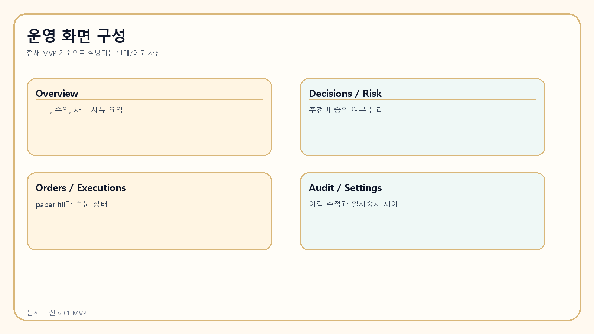

# 내부 학습 및 설명 자료

> 문서 버전: v0.1 MVP
>
> 문서 대상: 제품 설명, 데모, 질의응답을 직접 수행할 사람
>
> 설명 기준: 현재 리포지토리에 구현된 종이매매 MVP 범위
>
> 작성일: 2026-04-07



## 제품 정체성

이 제품은 “완전자율 투자 AI”가 아닙니다.  
정확한 표현은 **AI 분석 + 결정론적 통제형 운영 플랫폼**입니다.

- AI는 분석, 추천, 요약, 개선 제안 담당
- 리스크 엔진은 실제 실행 허용/차단 담당
- 기본 동작은 paper trading
- 실거래는 향후 guarded adapter 대상

## 한 문장 / 30초 / 3분 / 10분 설명 스크립트

### 한 문장 설명

AI가 매매 신호를 분석하지만, 실제 실행은 결정론적 리스크 엔진이 통제하는 종이매매 우선 자동매매 운영 플랫폼입니다.

### 30초 설명

이 제품은 다섯 개 AI 역할을 통해 시장 신호, 운영 상태, UX, 제품 개선 포인트를 분석합니다.  
하지만 AI가 직접 주문을 넣는 구조는 아니고, 리스크 엔진이 leverage, risk limit, stop/take profit, 데이터 신선도, 슬리피지 등을 검토해 최종 허용/차단을 결정합니다.  
현재는 종이매매 중심 MVP이며, 운영 대시보드와 감사 로그를 통해 “왜 실행됐는지”를 추적할 수 있습니다.

### 3분 설명

이 제품의 핵심은 “AI 추천”과 “실제 실행 통제”를 분리했다는 점입니다.  
시장 데이터가 들어오면 feature layer가 추세, 변동성, 거래량, RSI, ATR 같은 특징을 계산하고, Trading Decision AI가 구조화된 결정을 냅니다.  
그 다음 결정론적 리스크 엔진이 stop loss / take profit 유효성, risk per trade, leverage, stale data, slippage, daily loss, consecutive loss 같은 규칙을 검사합니다.  
허용되면 paper execution engine이 주문과 체결, 포지션, PnL을 기록하고, Chief Review AI가 운영 요약을 제공합니다.  
별도로 Integration Planner AI, UI/UX AI, Product Improvement AI는 배치 리뷰로 제품과 운영의 개선 포인트를 제안합니다.  
즉, 이 제품은 “수익 보장형 투자 엔진”이 아니라, **설명 가능하고 통제 가능한 자동매매 운영 기반**을 제공하는 MVP입니다.

### 10분 설명 뼈대

1. 제품 정의
2. 왜 AI와 실행 권한을 분리했는지
3. 5개 AI 역할 설명
4. 리스크 엔진 규칙 설명
5. paper execution 흐름 설명
6. 대시보드와 audit 설명
7. replay와 seed를 활용한 검증 설명
8. 현재 MVP 한계와 향후 확장 방향 설명

## 반드시 학습해야 할 핵심 개념

- 다중 에이전트 구조
- risk engine 우선 구조
- paper mode와 live mode의 차이
- strict schema validation
- audit trail
- replay
- scheduler window
- dashboard에서 추천과 승인 결과를 구분하는 법


## 기능별 설명 템플릿

### Trading Decision AI

- 쉬운 설명: 시장을 보고 “지금은 관망인지, 진입인지, 축소인지”를 구조화해서 제안하는 AI
- 정확한 설명: `TradeDecision` 스키마를 따르는 구조화된 결정 생성 계층
- 중요한 고객: 퀀트팀, 전략 검증형 트레이더
- 과장 금지: AI가 직접 주문을 넣는다고 설명하면 안 됨

### Chief Review AI

- 쉬운 설명: 여러 결과를 종합해 운영자에게 “지금 무엇을 해야 하는지” 요약해주는 AI
- 정확한 설명: 최근 decision, risk result, health event, alert를 종합해 운영 모드와 must-do action을 제안
- 중요한 고객: 운영팀, 관리자
- 과장 금지: 최종 실행 승인 권한이 있다고 설명하면 안 됨

### Integration Planner AI

- 쉬운 설명: 시스템을 더 잘 붙이고 자동화할 곳을 찾아주는 AI
- 정확한 설명: 로그와 시스템 상태를 검토해 integration point와 tech debt를 제안하는 배치 리뷰 계층
- 중요한 고객: 기업 고객, 플랫폼 팀
- 과장 금지: 실시간 매매 AI로 설명하면 안 됨

### UI/UX AI

- 쉬운 설명: 운영 화면을 더 이해하기 쉽게 개선 포인트를 제안하는 AI
- 정확한 설명: UI feedback 기반 suggestion 생성 계층
- 중요한 고객: 운영자, PM
- 과장 금지: 화면을 자동 배포한다고 설명하면 안 됨

### Product Improvement AI

- 쉬운 설명: 경쟁사 메모와 KPI를 보고 다음 개선 아이템을 제안하는 AI
- 정확한 설명: backlog recommendation 생성 계층
- 중요한 고객: 제품팀, 기업 고객
- 과장 금지: 매매 정책을 자동으로 바꾼다고 설명하면 안 됨

### 리스크 엔진

- 쉬운 설명: 실제 실행을 통제하는 안전장치
- 정확한 설명: leverage, risk_pct, stop/take validity, stale data, slippage, daily loss, consecutive losses, pause 상태를 검사하는 결정론적 정책 계층
- 중요한 고객: 모든 고객
- 과장 금지: AI 기능의 일부라고 설명하면 안 됨

### 종이매매 실행 엔진

- 쉬운 설명: 실제 돈이 아니라 시뮬레이션 방식으로 주문/체결/손익을 기록하는 엔진
- 정확한 설명: approved decision을 order / execution / position / pnl snapshot으로 저장하는 paper engine
- 중요한 고객: 개인 고객, 실험팀
- 과장 금지: 실제 거래소 연결이라고 설명하면 안 됨

## 기업 고객용 설명 포인트

- 내부 통제 구조가 분명합니다.
- 감사 가능성과 이력 추적이 좋습니다.
- AI 추천과 실행 통제가 분리돼 리스크 관리에 유리합니다.
- 운영 화면이 팀 협업과 상태 공유에 적합합니다.
- 향후 API/adapter 중심 확장 여지를 남겨둔 구조입니다.

## 개인 고객용 설명 포인트

- 안전한 실험이 가능합니다.
- 종이매매를 통해 구조를 먼저 이해할 수 있습니다.
- 왜 HOLD인지, 왜 차단됐는지 설명이 가능합니다.
- 리스크 제한이 명확합니다.
- replay를 통해 전략과 운영을 스스로 학습할 수 있습니다.

## 금지 표현 / 주의 표현

| 금지 표현 | 왜 문제인가 | 대신 써야 할 표현 |
| --- | --- | --- |
| 수익 보장 | 법적/신뢰 리스크가 큼 | 리스크 통제와 운영 가시성 중심의 MVP |
| AI가 자동으로 돈 벌어준다 | 과장이고 구조와 다름 | AI는 분석과 추천, 실행은 정책 엔진 통제 |
| 실거래 준비 완료 | 현재 범위를 벗어남 | 현재는 종이매매 MVP |
| 실제 거래소 연동 완비 | 현재 구현과 다름 | 향후 guarded live adapter 확장 가능 |
| 완성형 투자 엔진 | 과대 포장 | 운영 검증을 위한 production-credible MVP |

## 권장 표현

- 현재는 종이매매 MVP입니다.
- 실행은 리스크 엔진이 통제합니다.
- 실거래는 향후 guarded adapter 대상입니다.
- 분석/추천과 실행 통제가 분리된 구조입니다.
- 운영 추적과 설명 가능성을 중시하는 제품입니다.

## 예상 질문과 답변 스크립트

### 안전성은 어떤가요?

기본이 종이매매이고, 실거래는 비활성 상태입니다. 또한 stop/take, leverage, risk per trade, stale data, slippage 같은 결정론적 정책이 AI보다 우선합니다.

### 실거래가 되나요?

현재는 종이매매 중심 MVP입니다. 실거래는 향후 수동 승인과 리스크 승인, 감사 로그를 전제로 guarded adapter로 확장할 수 있는 경계만 준비되어 있습니다.

### AI 의존도가 너무 높은 것 아닌가요?

AI는 분석과 추천을 담당하지만, 실제 실행은 정책 엔진이 통제합니다. 핵심은 AI 의존이 아니라 **AI와 통제의 분리**입니다.

### 데이터 신뢰성은 어떤가요?

현재는 synthetic market data 기반입니다. 이는 MVP 데모와 운영 흐름 검증 목적에 맞춘 것이고, 실제 거래소 데이터 연결은 향후 확장 범위입니다.

### 유지보수와 확장성은 어떤가요?

API, 스키마, 서비스 계층, scheduler/worker 경계, adapter boundary가 분리되어 있어 확장 방향은 열어 둔 상태입니다. 다만 여전히 MVP이므로 운영 검증과 실거래 대응은 추가 작업이 필요합니다.

### 기업 도입 난이도는 어떤가요?

현재는 로컬/Docker 기반 MVP로 빠르게 검증하기 좋습니다. 기업 도입은 실데이터 연동, 권한, 보안, 배포, 모니터링 강화가 추가로 필요합니다.

## 데모 순서

1. Overview에서 현재 모드와 paper/live 구분 설명
2. Decisions에서 AI 추천 설명
3. Risk에서 정책 우선 구조 설명
4. Orders / Executions에서 paper fill 설명
5. Audit에서 추적 가능성 설명
6. Replay로 검증 가능성 설명


## 유지보수 관점에서 알아야 할 핵심 파일

- `backend/trading_mvp/services/orchestrator.py`
- `backend/trading_mvp/services/risk.py`
- `backend/trading_mvp/services/execution.py`
- `backend/trading_mvp/schemas.py`
- `backend/trading_mvp/models.py`
- `backend/trading_mvp/main.py`
- `frontend/app/page.tsx`
- `frontend/app/dashboard/[slug]/page.tsx`

## 스키마 / 가이드 / 의존성 source of truth

| 범주 | source of truth |
| --- | --- |
| Agent / API schema | `backend/trading_mvp/schemas.py` |
| Generated JSON Schema | `schemas/generated/*.json` |
| DB 모델 | `backend/trading_mvp/models.py` |
| API entrypoint | `backend/trading_mvp/main.py` |
| API 문서 | `docs/api.md` |
| 리스크 정책 문서 | `docs/risk-policy.md` |
| 아키텍처 개요 | `docs/architecture.md` |

## 의존성 및 실행 기본 지식

### Python 의존성 설치

```powershell
.\.venv\Scripts\python.exe -m pip install -e ".[dev]"
```

### 프런트엔드 설치/실행

```powershell
cd frontend
npm install
npm run dev
```

### Node / corepack fallback

global `node` / `npm`이 없는 환경에서는 portable Node + corepack 기반으로 `pnpm`을 사용할 수 있습니다.  
운영 설명 시에는 “frontend install/build에는 Node 계열 도구가 필요하다”는 점을 함께 말해야 합니다.

### Playwright 브라우저 설치

```powershell
cd frontend
pnpm exec playwright install chromium
```

### 운영 실행 순서

```powershell
powershell -ExecutionPolicy Bypass -File .\scripts\setup_local.ps1
powershell -ExecutionPolicy Bypass -File .\scripts\migrate.ps1
powershell -ExecutionPolicy Bypass -File .\scripts\seed.ps1
powershell -ExecutionPolicy Bypass -File .\scripts\run_backend.ps1
powershell -ExecutionPolicy Bypass -File .\scripts\run_frontend.ps1
```

### worker / scheduler

```powershell
powershell -ExecutionPolicy Bypass -File .\scripts\run_worker.ps1
powershell -ExecutionPolicy Bypass -File .\scripts\run_scheduler.ps1
```

### replay 실행

```powershell
powershell -ExecutionPolicy Bypass -File .\scripts\run_replay.ps1
```

## 현재 한계

- market data는 synthetic data입니다.
- 외부 모델은 deterministic mock provider가 기본입니다.
- live adapter는 stub/boundary 수준입니다.
- Docker Compose는 이 구현 환경에서 직접 실행 검증되지 않았습니다.

> 중요한 설명 원칙: 한계를 숨기지 말고, 대신 어떤 통제와 검증 구조가 이미 갖춰졌는지를 강조합니다.

:::pagebreak

## 설명 체크리스트

- 제품 정의를 한 문장으로 말할 수 있는가
- AI와 실행 통제의 차이를 설명할 수 있는가
- paper/live 차이를 설명할 수 있는가
- 현재 MVP 한계를 정확히 말할 수 있는가
- 기업/개인별 가치 포인트를 구분할 수 있는가
- 왜 HOLD가 자주 나와도 정상인지 설명할 수 있는가
- 리플레이가 왜 중요한지 설명할 수 있는가

## 마지막 암기 문장

이 제품은 “AI가 자동으로 돈을 벌어주는 시스템”이 아니라, “AI 분석 위에 리스크 통제와 운영 가시성을 올린 종이매매 우선 자동매매 운영 MVP”입니다.
